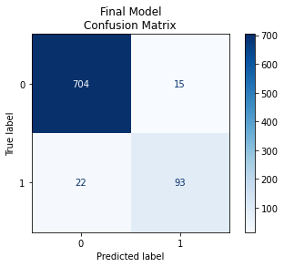

# Project 2 - Maple Homes

## Overview
1. This is GitHub repository represents the final project submission for Greg Osborne's Third project at FlatIron school. The project assignment was to analyze a selected set of data for churn rate predictions to present to Telecom.
## Business Understanding
1. Telecom wants to limit their customer departure rate, or churn rate, to as low as possible.
2. I made business recommendations based on the following three variables:
      * Oregon
      * Customer Service Calls
      * International Plan
## Data Understanding and Analysis
1. Source of data
      * All data used in this project was from Telecom. It is a database full of various statistics regarding specific customers and which left and which stayed. 
3. Visualizations
  One visualization (the same visualization is in the notebook)
    * 
  Seven graphics exclusively for aesthetics in the Google Slides doc.
    * 
    * 
    * 
    * 
    * 
    * 
    * 
    * 
    * 

## Conclusion
* This analysis is limited by time and budget. There are many other factors to consider when trying to predict a customer's churn rate. The three recommendations I make are:
    1. Check ORegon.
      * Oregon had the highest churn rate of all states.
      * Is there greater competition in Oregon?

    2. Review Customer Service Calls
      * The more often customers called customer service, the more likely they were to leave.
      * What calls are departing customers making to customer service?
      * How do departing customers rate customer service in the survey results?
      * How does the wait time for customer service compare to other companies?
      * What do people say about our customer service? What about online?

    3. Review International Rates. 
      * Departing customers were four times more likely to have an international rate plan.
      * Every departing customer had made at least one international call.
      * How does Telecom’s international plan hold up against the competition?


## Repository Structure

```
  ├── data : data used for modeling
  ├── Visualizations : images used in PPT and readme
├──.canvas : File provided by Flatiron
├──.gitignore : File provided by Flatiron
├──github.pdf : PDF of repository
├──LICENSE.md : File provided by Flatiron
├──Notebook.pdf print of jupyter notebook used for modeling
├──Presentation.pdf : Presentation for Stakeholders
├──README.md : project information and repository structure
└──student.ipynb : Jupyter Notebook
```

