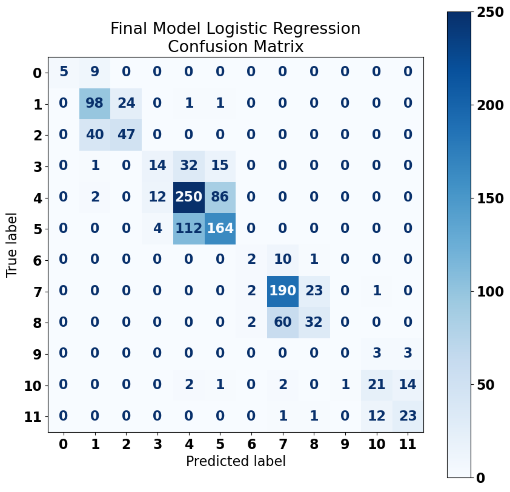
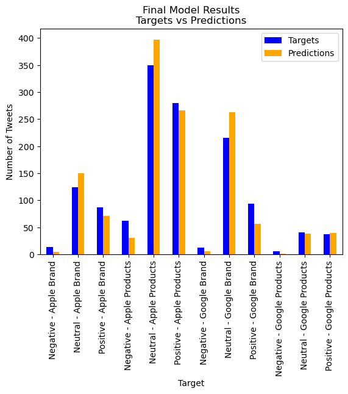
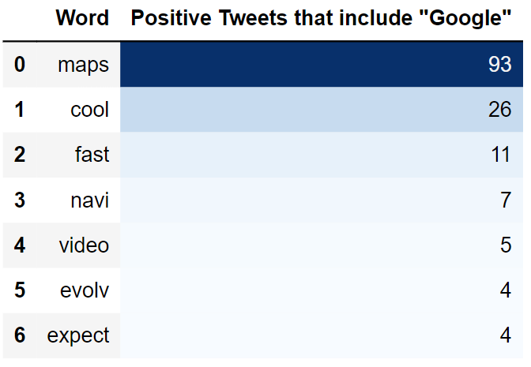
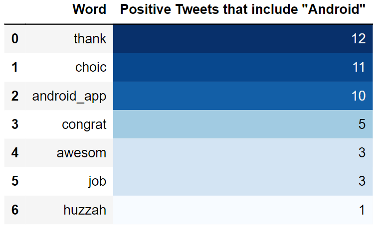
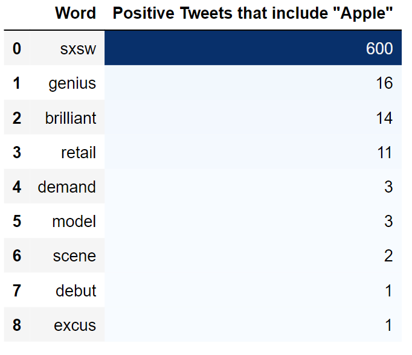
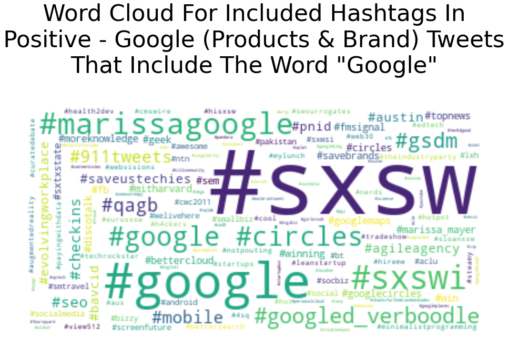
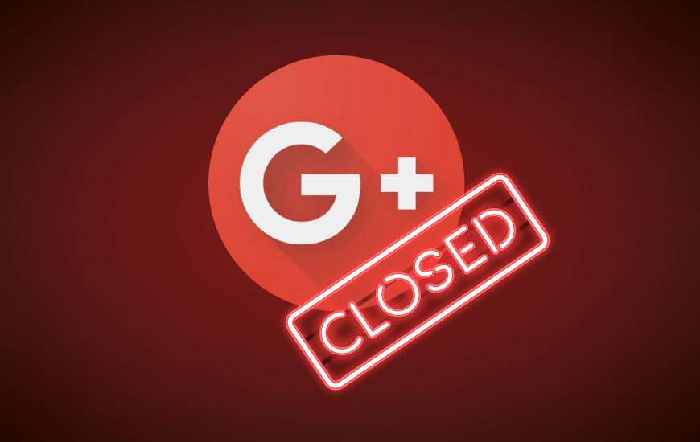

# Project 4 - Advanced Machine Learning

## Overview
1. This GitHub repository is Greg Osborne's fourth project at FlatIron school. The project assignment was to create a Natural Language Processing (NLP) model to analyze a set of tweets from SXSW 2011 that discuss both Google and Apple. Google wants a model that can give them a snapshot of their public perception to help them plan for the future.

## Business Problem
Some people view Google more negatively than their chief competitor, Apple. Google needs a tool to help measure the publics' sentiment toward both Apple and Google to strategize for a more positive public sentiment. This tool will offer Google insight to guide their business decisions.

## Natural Language Processing solution
Google's departments of both Public Relations and product development could benefit from a snapshot of the publics' perception of both Google and their competition, Apple. The input of this model is tweets that discuss either Google or Apple. The output will how many of the tweets view both companies, positively and negatively, as well as a mentioning them in a neutral way. The model will also classify whether each tweet addresses the company brand, or the products it makes. So each tweet is classified as:

**Company**: Google or Apple
**Aspect of Company**: Brand or Product
**Emotion**: Positive, Negative, or Neutral
This works out to each tweet being classified as one of twelve different classifications:

1. Negative - Apple - Brand
2. Neutral - Apple - Brand
3. Positive - Apple - Brand
4. Negative - Apple - Products
5. Neutral - Apple - Products
6. Positive - Apple - Products
7. Negative - Google - Brand
8. Neutral - Google - Brand
9. Positive - Google - Brand
10. Negative - Google - Products
11. Neutral - Google - Products
12. Positive - Google - Products

The second insight the Natural Language Processing provides comes in associated words. When you think of McDonald's, you probably think of some kind of food, you may also think of Happy Meals, Burgers, French Fries, or a sugary iced frappuccino. What do people think when they think of when they think about Google? Or Google's competition Apple?

Through Word2Vec vectorization methods, we can assign a multidimensional vector to each word found in a set of tweets. Then, we can measure which words align the best. By doing so, we can see what words people identify with each company, and the companies products. And, we can perform this analysis for people speaking both negatively and positively.

Greg Osborne accepted the challenge to build such a tool.

## Data Understanding and Analysis
1. Source of data
      * All data used in this project was from Tweets during the 2011 SXSW festival. The tweets were selected by a separate entity. The tweets were all had labeled emotions, but they did not all have labeled companies or products discussed. Data cleaning was necessary. 
3. Visualizations
  Seven visualizations that are also in the notebooks.
    * 
    * 
    * 
    * 
    * 
    * 
    * 
  Ten graphics exclusively for aesthetics in the Google Slides doc.
    * 
    * 
    * 
    * 
    * 
    * 
    * 
    * 
    * 
    * 

## Conclusion
The analysis of the tweets available make it clear that Google is quite behind Apple in terms of both discussion and positive sentiment. To turn this around, I recommend:

### Further Develop the Word Association Tool

No one person's, or one consulting firm's, assessment of the data found in 6000 tweets is complete. Google can give the word association tools to multiple departments. The maps team can look for word associations relevant to their application, and the search team can do the same for their purposes. This tool needs to be so accessible that non-technical people can use it, and perform searches to satisfy their own curiosity. This will lead to improvement areas and initiatives associated with their own products, and inspire creative innovations from Google's highly qualified employees.

### Track Public Perception at SXSW With The Classification Model

The results are in. People tweeted about Apple more often, and more positively, than they did with Google. Google needs to improve their image. I'll address some specific ideas on how they can do that below. Regardless of what strategy Google chooses to improve its image, Google needs to keep track of how they are doing compared to its rival, Apple. 

The simplest way to do this is to gather a sample of tweets every year at SXSW. This will provide a standardized audience and time of year that will provide meaningful data, allowing Google to track perception changes. Once Google have tweet sets from each of the past 12 SXSW festivals, Google will see how their image has changed over time, and they can then make better assessments regarding their future.

### Create Google Branded Products

In 2011, Chromebooks were not available yet. Google brand phones did exist, but customers associated them with the companies that made them rather than Google, like HTC or Samsung. Google didn't sell anything physical to customers to get them excited, and this was the most glaring disparity between how people tweeted about Google and Apple.

People were excited to get to get their recently released iPad 2. People were excited to go inside the "Pop-Up" Apple Store to buy products. Google, by contrast, had a party that people could go to and meet Matt Damon. What Google was offering couldn't compete with the excitement of getting a new tech toy. 

Google needs to create top of the line chromebooks and phones if it is going to compete with the excitement people have about Apple. It cannot rely on software alone.

### Monetize Google Maps

Google Maps was what tweeters enjoyed most about Google at SXSW 2011. Google needs to ensure its ease of use and deep catalog of locations, including robust information about each one, is as popular in the future as it was at SXSW 2021. An upset in the digital maps business is certainly possible. Multiple other mapping software and apps exist. 

I doubt people would continue to use Google Maps if they had to purchase the app, but you could sell advertising space to companies so they will appear more prominent when people search for their type of business. Google could also charge companies who want to pay for trips planned to their destinations. Whatever Google does though, they need to ensure people still enjoy using Maps.

### Try Social Media Again

As a technology user, it was interesting to go back in time to 2011, when Google Plus was not a product in people's hands, but an idea in their heads. At that time, Facebook and Twitter had established their dominance in the Social Media space. The Arab Spring was in the midst of happening. People had a wonderfully positive view of the potential of Social Media. We had already seen some social media companies come and go. Myspace had already been closed for three years, and people seemed to think it was possible for another media giant to come in and rock the boat. Though Instagram was a few months old at the time, it's rise in popularity and the rise of TikTok are the only two players competing with Twitter and Facebook. Facebook purchased Instagram, of course, so TikTok is the only company to challenge their dominance in a decade.

It's possible the social media space is due for a major upset. All of these companies have dismal customer opinion. People have come to view them less as platforms to keep up with family and old friends, and more as hellscapes of trolling and the exploitation of people's anger for these company's profit. 

Google has the financial resources to give social media another try, and specifically avoid the pitfalls of the other platforms. In 2023, the public is aware of the myriad of abuses of the current social media platforms. Google can use their negative sentiment to develop a product that avoids the same problems. It may be challenging, but it's possible. 

### Build on Google's Strengths Counter Apple's Strengths

Two of the positive words that came up during the word association analysis with Google were "Cool" and "Fast". This is what Google's customers associated with the brand in 2011. Contrary to that, people associated Apple with words like "Genius" and "Brilliant". They also associated the iPad with the "Future".

Make sure Google products continue to inspire people thinking they are "cool" and make sure they work seamlessly, very fast. Get with a marketing team to brainstorm ideas about how to combat the words that Apple is associated with.

### Bring Apps to Android Faster

A repeated complaint for Android users was simply that apps that were already available on Apple were not available yet on Google. There are multiple reasons why developers might choose to launch on Apple first. Launch an investigation. Incentivize third-party developers to launch their apps on Android at least simultaneously with Apple, if not before the competition.


## Repository Structure

```
  ├── Visualizations : images used in PPT and readme
├──Notebook-Word-Associations.pdf : PDF copy of Notebook for testing Data
├──Notebook.pdf : Print of main Jupyter Notebook used for modeling 
├──Presentation.pdf : Presentation for Stakeholders
├──README.md : Project information and repository structure
├──github.pdf : PDF of repository
├──judge-1377884607_tweet_product_company.csv : The raw data analyzed
├──Student-Word2Vec-Workspace.ipynb : Jupyter Notebook for testing Data
└──Student.ipynb : Jupyter Notebook

```

